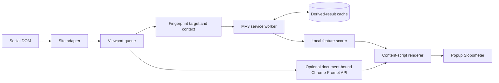

# Runtime architecture

The content script owns DOM extraction, per-route state, viewport scheduling and rendering. The MV3 service worker owns local feature scoring, schema validation, settings and IndexedDB. Popup/options are Preact pages. All injected page UI uses native DOM and Shadow DOM.

A real Chromium integration test rejected the original direct content-script Worker URL architecture. The small scorer therefore executes in the existing extension service worker, off the host page's thread, without extra page-accessible resources or an offscreen document. This implementation decision supersedes the original worker placement in SPEC.md.

Each platform adapter owns selectors, independent authored-body boundaries, identity and parent context. It has no dependency on providers, cache or scoring. Synthetic adapter uses the packaged harness page, not arbitrary local websites.

Two IntersectionObservers distinguish visible and near-visible candidates. Discovery traverses inserted subtrees in ≤5 ms/200-node slices. Candidate registrations are capped at 1,000; bound entries are trimmed beyond 300, retaining current viewport items. Passive throttled viewport sampling rediscovers dropped items without body rescanning. Detached nodes are released. The numeric route aggregate retains at most 10,000 unique fingerprints and resets on navigation.

Classification uses batches of ≤16, exact-key cache lookup, and per-batch fingerprint deduplication. A fingerprint hashes target text, identity, route and bounded parent/root/quote context, so edits invalidate contextual scores. Mode changes invoke only presentation. Slop Only preserves context ancestors; Blocker requires release-approved results or local corrections.

Optional model analysis runs separately from the local queue. It uses ≤12 items per prompt, one in-flight prompt per tab, an 8-second abort deadline, fresh cloned context, strict output validation and 60-second idle cleanup. Local results render before model work. Chrome model results expire after a day because Chrome can update its model without exposing a stable model snapshot ID.

The scorer is deliberately provisional. No implemented provider authorizes automatic hiding. OpenAI plan/API integration remains gated by the authentication and credential restrictions documented in SPEC.md; the production manifest has no remote API host permission.

First-run setup is a packaged extension page. `runtime.onInstalled` opens it only for a fresh installation, with a durable `presented` flag written before opening the tab. Completion and the chosen view/sites are saved together to `chrome.storage.local`; other settings are retained. Updates do not auto-open setup. Unfinished installations get a popup reminder, and users can manually review setup from Settings. These UI messages are accepted only from trusted extension pages, and setup never starts a model download.
