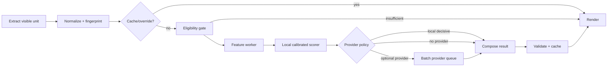
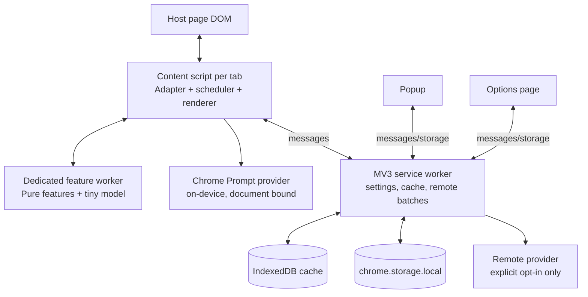
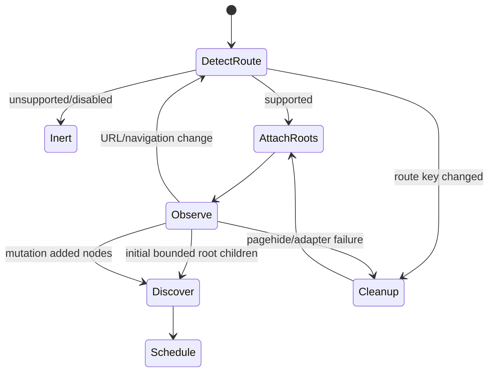

# SlopZap v0.1 Technical Specification

Status: implementation-ready draft

Implementation note (2026-10-07): the repository now contains a development alpha. Section 42 records decisions verified during implementation and takes precedence over conflicting original design details below. Public-release classification and live-platform validation gates remain unmet.

Target: Chrome Manifest V3, desktop

Last verified: 2026-10-08

License: MIT (already present in this repository)

## 1. Product definition

SlopZap is a privacy-first Chrome extension that identifies and manipulates individual social-content units showing signals of synthetic, low-information engagement. It is an “ad blocker for AI-style social noise,” not a forensic authorship detector.

The extension operates on posts, comments, replies, and Medium articles. It never classifies a whole page as a single document. Every result is probabilistic, scoped to one extracted content unit, and usable in four modes:

- **Slop Blocker:** replace likely slop with a reversible placeholder.
- **Slop Only:** retain matching branches and minimal ancestor context; hide other units reversibly.
- **Slop Goggles:** leave content intact and add a compact score annotation.
- **Slopometer:** aggregate only the units actually classified in the current page session.

“Slop” is a product-specific construct, not “probability that AI wrote this.” It combines signals of formulaic generation, contextual redundancy, generic engagement, low specificity, and low information gain. AI-assisted but useful content may score low; formulaic human engagement farming may score high.

## 2. Goals and success principles

1. Make social discussions easier to inspect by filtering or highlighting suspected synthetic low-value content.
2. Prefer false negatives over false positives. Hiding a genuine human contribution is more damaging than allowing some slop through.
3. Remain useful offline and without a SlopZap account or backend.
4. Add no perceptible scrolling, page-load, typing, or interaction latency.
5. Be auditable: extraction, features, score composition, network use, and retention are source-visible and documented.
6. Isolate volatile platform DOM knowledge behind small, fixture-tested adapters.
7. Fail open: uncertainty, parser failure, provider failure, and extension failure leave host content visible.

Product-level targets for the release candidate are in §36.

## 3. Non-goals for v0.1

No image, audio, video, transcript, profile-photo, bot-account, fake-account, political, ad, or author-identity detection. No reporting or moderation actions, generation or rewriting, automated replies, community features, shared blocklists, leaderboards, accounts, sync, analytics warehouse, billing, subscriptions, mobile browsers, Safari, Firefox release, enterprise dashboard, public API, or proprietary SlopZap inference backend.

Private messages, direct-message surfaces, editors, compose boxes, forms, password fields, and private/group-only spaces are categorically excluded from discovery and classification.

## 4. Product philosophy and classification claim

SlopZap must never say “written by AI,” “AI detected,” or equivalent. Permitted language includes “Slop Score,” “strong synthetic/low-value signals,” and “uncertain.” Scores are estimates produced by a versioned product classifier, not calibrated authorship probabilities.

The false-positive posture is asymmetric:

- Automatic hiding requires a high threshold and sufficient evidence.
- Uncertain items remain visible in Blocker and are absent from Slop Only by default.
- Items too short or context-poor to assess return `insufficient_evidence`, not a fabricated percentage.
- A local user override always wins over classifiers.

The classifier may recognize AI-style patterns but does not infer intent, truthfulness, account identity, or moral worth. Non-native English, polished prose, em dashes, lists, grammar, or vocabulary alone must never be decisive features.

## 5. User experience

### 5.1 First run

The extension installs disabled for remote transmission and enabled locally on the five supported public-site surfaces. The onboarding panel states:

> SlopZap estimates AI-style, low-information social content. It cannot prove who or what wrote a post. Local analysis stays on your device. Optional providers are disclosed before any text is sent.

Default mode is **Slop Goggles** for the first session because it exposes mistakes without hiding content. The user may select Blocker as the persistent default.

Implemented onboarding: `onboarding.html` opens automatically on a fresh `runtime.onInstalled` installation event. It presents score/privacy guidance, a default-view choice, and five site toggles, followed by an optional demo handoff. A durable local presentation flag prevents repeated automatic opening; completion is stored with the selected view/sites. Updates and browser restarts never reset preferences or auto-open setup. Closing unfinished setup leaves a popup reminder. Settings includes manual review. Users may keep current defaults or disable every site; provider/global-enable/threshold settings are preserved. Setup performs no model downloads and adds no permissions.

### 5.2 Modes

`normal` removes all SlopZap presentation but may continue classification according to the current scheduler; it is an explicit fifth internal state. Mode switching re-renders existing results synchronously and causes zero new inference.

Default thresholds:

| Use | Threshold | Rationale |
|---|---:|---|
| Goggles visible badge | 0.50 | Shows uncertainty without altering content |
| Slop Blocker | 0.85 | High precision is required to hide |
| Slop Only | 0.70 | Humorous inspection mode benefits from more recall |
| “Strong signals” label | 0.85 | Same semantic boundary as hiding |

Settings permit Blocker 0.75–0.95 and Slop Only 0.50–0.90 in 0.05 steps. The UI calls them “more cautious” and “more aggressive,” not model confidence calibration.

### 5.3 Per-item states

Each unit is exactly one of `discovered`, `queued`, `classifying`, `classified`, `insufficient_evidence`, `failed`, or `detached`. Only `classified` can be hidden automatically. Pending, insufficient, and failed items remain unchanged.

## 6. Supported platforms and v0.1 surfaces

| Platform | Included | Explicit exclusions/notes |
|---|---|---|
| LinkedIn | public/home feed posts, comments, expanded replies | messaging, notifications text, compose/editors, jobs |
| X | timelines, thread posts/replies, quote commentary | quoted source is context, never attributed to quoting user; DMs excluded |
| YouTube | top-level comments and expanded replies | descriptions, transcript, live chat, video/audio excluded |
| Reddit | post title/body, top-level and arbitrarily nested comments | preserve branches; support current desktop UI, fail open on unsupported legacy views |
| Medium | article title/body and responses where exposed | article uses long-form policy; member-only visible text may be local-only unless user separately enables remote |

Adapters must identify a supported route before observing. Unknown routes and ambiguous surfaces are inert.

## 7. Content-unit model

```ts
export type Platform = "linkedin" | "x" | "youtube" | "reddit" | "medium" | "synthetic";
export type ContentKind =
  | "post" | "comment" | "reply" | "quote_commentary"
  | "article" | "article_response";

export interface ContentUnitSnapshot {
  instanceId: string;          // random per DOM binding; never persisted
  platform: Platform;
  kind: ContentKind;
  platformId?: string;         // extracted stable ID, not an author ID
  parentPlatformId?: string;
  rootPlatformId?: string;
  canonicalRouteKey: string;   // normalized path/thread key, no query/fragment
  text: string;                // visible authored text only
  languageHint?: string;       // BCP-47 only when platform/Chrome exposes it
  context: ClassificationContext;
  depth: number;
  fingerprint: string;
  discoveredAt: number;
}

export interface ClassificationContext {
  parentText?: string;
  rootTitle?: string;
  rootExcerpt?: string;
  quotedSourceText?: string;
  platform: Platform;
  kind: ContentKind;
}

export interface DomBinding {
  instanceId: string;
  container: HTMLElement;
  textElement: HTMLElement;
  annotationAnchor: HTMLElement;
  parentInstanceId?: string;
  generation: number;
}
```

DOM elements never cross the content-script boundary and never enter persistent storage. `WeakMap<Element, BindingState>` is the primary node association. A separate `Map<instanceId, WeakRef<Element>>` is allowed when supported; it must be swept on route change and every 60 seconds. No retained strong reference may outlive node detachment.

Author names, handles, avatar URLs, engagement counts, verification state, and account metadata are not extracted in v0.1. They add privacy and bias risk without being necessary to the single purpose.

## 8. Functional requirements

1. Discover and independently classify the supported units in §6.
2. Preserve reply hierarchy under all modes.
3. React to initial DOM, inserted/removed nodes, expansion, virtualization/recycling, and SPA route changes without full-body rescans.
4. Prioritize visible and near-visible units; do not classify distant infinite-feed content.
5. Cache by content fingerprint and classifier version.
6. Render all modes from the same stored result.
7. Expose page aggregate and sample size.
8. Allow per-item reveal and local `Not slop` / `Definitely slop` overrides.
9. Work locally when offline, signed out, rate-limited, or provider-unavailable.
10. Never mutate a host unit that the active adapter cannot identify safely.

## 9. Classification philosophy and pipeline

The v0.1 pipeline is a cascade, not an authorship detector:



### 9.1 What is never classified

- Empty/whitespace-only content, UI labels, usernames, timestamps, reaction counts, hashtags-only units, link cards without authored text, code-only blocks, or text under 3 Unicode word-like tokens.
- Any node inside `input`, `textarea`, `[contenteditable]`, forms, dialogs recognized as composers, DMs/messages, or adapter-declared sensitive roots.
- Hidden/collapsed text that is not currently rendered for the user.
- Distant units outside the scheduler envelope.
- Text over limits until safely reduced under the long-form policy.

### 9.2 Evidence policy

The local scorer produces a score and evidence sufficiency. It may finalize a high score only if at least two independent feature families contribute (for example contextual redundancy plus generic-engagement structure). A single token/style cue cannot finalize.

For fewer than 8 tokens, return `insufficient_evidence` unless parent context exists and the reply matches a narrowly defined generic-response template with very high contextual redundancy. Even then, local-only output is capped at 0.79, below the default Blocker threshold. Remote/on-device model output may classify 3–7 token replies but Blocker still requires `evidenceQuality >= 0.8`.

For 8–19 tokens, local results are capped at 0.84 unless a contextual provider agrees. Twenty or more tokens have no length cap. These caps embody the false-positive posture.

### 9.3 Feature families

Feature computation runs in a dedicated worker and includes:

- lexical/statistical: token/character counts, sentence-length variance, repeated n-grams, punctuation ratios, type-token ratio;
- formulaic structure: greeting/praise/agreement → paraphrase → generic conclusion patterns;
- contextual redundancy: word/character n-gram overlap and cosine similarity over hashed bag-of-words between reply and parent/root;
- novelty: reply tokens/concepts absent from parent, concrete entities/numbers/URLs/code spans;
- specificity: direct references to parent details versus interchangeable praise;
- engagement cues: generic affirmation/disagreement and low-information calls to engage;
- uncertainty safeguards: language support, shortness, quoted/code ratio, extraction truncation.

Regex lists are narrow, versioned, language-specific, and explanatory—not a detector by themselves. English is the only calibrated language at v0.1 launch. Non-English content is `unsupported_language` for the tiny scorer but may use a capable on-device/cloud provider when explicitly available; otherwise it remains visible.

### 9.4 Local scorer

Ship a logistic-regression or small gradient-boosted model trained on the version-controlled evaluation corpus, exported as JSON weights/trees. Hard budgets: compressed artifact ≤100 KiB, worker heap ≤8 MiB attributable to the model, cold initialization ≤25 ms on reference hardware, median feature+score time ≤2 ms/unit in batches of 16. No ONNX Runtime, Transformers.js, WebGPU, or bundled transformer in v0.1.

This choice is intentionally modest: it is auditable, fast, CSP-simple, and useful as an offline triage/fallback. It must not be marketed as AI-authorship detection. If evaluation gates are not met, ship the scorer in annotation-only mode (scores capped below automatic hide) rather than weaken safety.

### 9.5 Optional provider cascade

Provider policy values are `local_only` (default), `on_device_if_available`, and `remote_opt_in`. Chrome’s Prompt API provider is selected before any remote provider. It runs locally but is capability-dependent. Remote inference is never automatic merely because credentials exist; the user must select `remote_opt_in` and accept the text-transmission disclosure.

Provider calls are useful when local score is within `[0.35, 0.90]`, evidence is sufficient, text/context fits policy, and the result could affect presentation. Scores below 0.35 are locally accepted as low; scores at or above 0.90 may be accepted only when two feature families support them and length caps permit. User overrides bypass all inference.

## 10. Slop Score semantics

```ts
export type ClassificationStatus = "classified" | "insufficient_evidence" | "unsupported_language" | "failed";

export interface SignalScores {
  formulaic: number;
  redundancy: number;
  genericEngagement: number;
  lowInformation: number;
  syntheticStyle: number;
}

export interface ClassificationResult {
  fingerprint: string;
  status: ClassificationStatus;
  slopScore?: number;           // [0,1], product score, not authorship probability
  evidenceQuality: number;      // [0,1], sufficiency/reliability of this judgment
  signals?: SignalScores;
  explanationCodes: string[];  // controlled vocabulary; never model prose
  sources: ("local" | "chrome_prompt" | "openai" | "override")[];
  classifierVersion: string;
  providerModel?: string;
  classifiedAt: number;
}
```

User-facing bands:

| Score | Label | Default treatment |
|---:|---|---|
| 0–49 | Low signals | no badge unless debug mode |
| 50–69 | Uncertain | Goggles badge only |
| 70–84 | Likely slop | Slop Only match; visible in default Blocker |
| 85–100 | Strong slop signals | hidden by default Blocker |

If `evidenceQuality < 0.6`, show “Not enough evidence” rather than a percentage. Percent formatting is integer rounding for legibility and must be labeled `Slop Score` in tooltip/accessible name.

### 10.1 Combining local and provider results

Providers return the same signal dimensions. They do not return a final DOM action. Composition is versioned and deterministic:

```ts
if (!provider) final = local;
else {
  const agreement = 1 - Math.abs(local.slopScore - provider.slopScore);
  const remoteWeight = provider.evidenceQuality >= 0.8 ? 0.70 : 0.55;
  final = remoteWeight * provider.slopScore + (1 - remoteWeight) * local.slopScore;
  evidenceQuality = Math.min(provider.evidenceQuality, 0.5 + 0.5 * agreement);
}
```

If scores differ by more than 0.40, mark `classifier_disagreement`, cap evidence quality at 0.59, and do not auto-hide. This is an abstention, not a tie broken in favor of the remote model.

## 11. Contextual classification

Context is minimal and type-specific:

| Unit | Context sent to a provider |
|---|---|
| reply | immediate parent text (max 800 chars) + root title/excerpt (max 300 chars) |
| top-level comment | root title/excerpt (max 500 chars) |
| standalone post | target only |
| quote commentary | commentary is target; quoted source (max 600 chars) is explicitly labeled context |
| Reddit post body | title + body |
| Medium article | title + chunk summaries/features; see below |

No sibling comments, author metadata, full thread, URL query parameters, or DOM HTML are sent. Truncation preserves the beginning and end (`60% + 40%`) and sets a flag. Context is structured as data fields, never interpolated into provider instructions.

Medium articles use local features over at most 8,000 visible characters. Optional model analysis classifies up to five deterministic chunks (opening, closing, and evenly spaced middle chunks, 1,200 characters each), then combines the median chunk score with a 20% weight for cross-chunk repetition. An article requires at least three valid chunks. Article classification is lower priority than social replies and never runs while a visible reply batch is waiting.

## 12. Manifest V3 architecture



### 12.1 Execution-context ownership

| Context | Owns | Must not own |
|---|---|---|
| content script (isolated world) | route session, adapter, DOM discovery, viewport queue, weak DOM bindings, rendering, document-bound Chrome Prompt calls | credentials, persistent cache implementation, remote network provider calls |
| dedicated worker spawned by content script | normalization-independent feature computation and tiny local scoring | DOM, network, storage, Chrome APIs |
| service worker | persistent settings, IndexedDB, provider batching, fetch, capability summaries | DOM state, long-lived in-memory truth |
| popup | compact controls and current-tab aggregate snapshot | classifier or DOM logic |
| options | settings, privacy disclosure, provider state, cache controls, debug export | raw browsing content history |

The service worker is disposable. Every event handler reconstructs needed state from its message and persistent stores. In-flight remote batches live in memory and may be lost on worker termination; callers time out and safely requeue once. No keepalive hacks or polling ports.

The content script is statically declared only on exact supported origins and runs in Chrome’s isolated world at `document_idle`. No main-world injection is required. No offscreen document is needed in v0.1. The feature-worker bundle is a packaged, exact-path `web_accessible_resource` limited to the five host match patterns; this is necessary for a content-script-created `Worker`. It contains only pure feature/model code, no secrets or privileged APIs. Verify the final WXT manifest and worker URL in an E2E test because worker bundling is a security boundary.

### 12.2 Message protocol

Messages are discriminated, schema-validated, and capped at 256 KiB:

```ts
type Request =
  | { type: "CACHE_LOOKUP"; requestId: string; keys: string[] }
  | { type: "CLASSIFY_BATCH"; requestId: string; items: ProviderInput[]; priority: 0 | 1 }
  | { type: "CANCEL"; requestId: string; fingerprints: string[] }
  | { type: "PAGE_SNAPSHOT"; tabSessionId: string; aggregate: SlopometerState }
  | { type: "GET_SETTINGS" }
  | { type: "CLEAR_CACHE" };

type Event =
  | { type: "CLASSIFICATION_RESULT"; requestId: string; results: ClassificationResult[] }
  | { type: "SETTINGS_CHANGED"; settings: Settings }
  | { type: "PROVIDER_STATE"; state: ProviderState };
```

Batch operations are preferred over per-item chatter. The content script performs one cache lookup for each discovery burst (up to 50 keys), one classification message per batch, and debounces page snapshots to at most 2/second.

## 13. Site-adapter contract

```ts
export interface SiteAdapter {
  readonly platform: Platform;
  matches(url: URL): boolean;
  getRouteKey(url: URL): string;
  findRoots(document: Document): AdapterRoot[];
  discover(added: readonly Node[], root: AdapterRoot): Candidate[];
  parse(candidate: Candidate, ctx: ParseContext): ParsedUnit | null;
  refresh(binding: DomBinding, ctx: ParseContext): ParsedUnit | "unchanged" | null;
  isSensitive(node: Element): boolean;
  healthCheck(root: AdapterRoot): AdapterHealth;
}

export interface AdapterRoot {
  element: Element;
  role: "feed" | "thread" | "comments" | "article";
  selectorVariant: string;
}

export interface ParsedUnit {
  kind: ContentKind;
  platformId?: string;
  parentPlatformId?: string;
  rootPlatformId?: string;
  textElement: HTMLElement;
  container: HTMLElement;
  annotationAnchor: HTMLElement;
  text: string;
  depth: number;
  contextRefs: ContextReference[];
}
```

Adapters contain selectors, extraction, hierarchy resolution, and platform IDs. They do not import classifier, cache, provider, score aggregation, or mode modules. Shared adapter helpers may cover DOM safety, text-node extraction, visibility, and fixture utilities only.

### 13.1 Selector policy and resilience

Priority order: stable semantic attributes or platform IDs → accessible roles/labels combined with structure → stable links/permalinks → narrowly scoped structural fallbacks. Obfuscated CSS class names may only be the last element in a documented fallback chain and must have a fixture test.

Every selector chain has a named variant so debug metrics can report which path worked. Parsing is defensive and returns `null` on ambiguity. A candidate is rejected when multiple plausible authored-text nodes exist, the annotation anchor is missing, or the node is in a sensitive root.

Adapter health checks compare discovered candidate/parse counts and invariant failures. If 20 consecutive candidates fail or parse success falls below 50% after at least 20 candidates, the adapter trips a per-route circuit breaker, removes SlopZap presentation for that route, and reports a privacy-safe diagnostic code. It never broadens selectors automatically.

### 13.2 Platform extraction rules

These behavioral rules are mandatory even though exact selector strings must be established from current sanitized fixtures during each adapter milestone:

| Adapter | Candidate/identity strategy | Authored-text and hierarchy rules |
|---|---|---|
| LinkedIn | begin at semantic feed/comment containers; prefer activity/comment URNs or permalink IDs | exclude actor header, repost/quoted card, reactions, link preview, and “see more” control; replies point to the immediate comment container, not merely the post |
| X | begin at article/tweet containers and stable status links or tweet test IDs | extract the author’s primary tweet text; quote-card text is `quotedSourceText`, never concatenated into target; in thread view resolve reply relationship from DOM conversation structure and status links, otherwise root context only |
| YouTube | begin at renderer elements for comment threads/comments and use comment entity/permalink IDs | extract formatted comment text only; the thread renderer owns top-level comment plus reply list, while each reply is independently bound; ignore creator heart, badges, timestamps, and translated duplicate text |
| Reddit | begin at post/comment semantic containers and prefer post/comment thing IDs or permalinks | extract title/body separately for post, comment body only for comments; determine parent from closest enclosing thread/parent ID, never indentation pixels; keep child-list element outside the hideable body |
| Medium | begin at `article`/main story body and response containers, using canonical story/response IDs when available | collect visible authored paragraphs/headings/code in reading order while excluding nav, clap/follow controls, recommendations, captions duplicated in alt text, and embeds; responses are separate units |

Every adapter declares `sensitiveSelectors` for messaging, editors, dialogs, and compose surfaces, plus `unitBoundaryInvariant` tests proving a hideable body does not contain its child reply list. If a platform does not expose a trustworthy immediate-parent relation (notably some X feed views), leave `parentPlatformId` absent and use only root context; do not infer a false hierarchy.

## 14. Dynamic-site lifecycle



### 14.1 Initial discovery

For each smallest stable adapter root, scan only its direct/known container descendants using the adapter’s candidate selector once. This is not a `document.body` scan. Cap initial candidate work at 200 nodes per root and yield every 5 ms; further content will enter through intersection/mutation discovery.

### 14.2 Mutation handling

Attach one `MutationObserver` per adapter root with `{childList: true, subtree: true}`; do not observe attributes or character data globally. Its callback only:

1. appends `addedNodes` to a `Set<Node>`;
2. records removed bound roots for cleanup;
3. schedules one microtask followed by a time-sliced discovery drain.

The callback target is <1 ms p95. Discovery processes at most 100 added roots or 5 ms per slice, then yields through `scheduler.postTask({priority: "background"})` when available, otherwise `requestIdleCallback` with a 100 ms timeout, otherwise `setTimeout(0)`.

Virtualized/recycled nodes are detected when a known container’s extracted platform ID or normalized text fingerprint changes. Increment `generation`, cancel stale work, clear injected state, and bind as a new unit. Removed nodes are unobserved immediately. Results include fingerprint and generation; mismatches are discarded.

### 14.3 SPA navigation

Use four signals: `chrome.webNavigation` is unnecessary and therefore not permissioned. Prefer the web Navigation API's `currententrychange`/`navigate` notification when exposed to the isolated content-script world; also listen to `popstate`, `hashchange`, and a 250 ms debounced comparison triggered by root mutations/focus/visibility changes. A tiny isolated-world comparison of `location.href` is sufficient; patching host `history` is forbidden. While a supported document is visible, a 1-second timer is the final fallback and performs only the string comparison; stop it when hidden or cleaned up.

When `adapter.getRouteKey(new URL(location.href))` changes:

1. increment route generation and abort its `AbortController`;
2. disconnect observers and intersection observers;
3. remove SlopZap wrappers/placeholders/annotations and restore host presentation;
4. clear bindings, queues, and aggregate (cache remains);
5. select adapter and attach new roots after one animation frame, retrying with bounded backoff (100, 250, 500, 1,000, 2,000 ms; then wait for mutation/visibility signal).

## 15. Viewport scheduler

One `IntersectionObserver` watches unit containers with `rootMargin: "100% 0px 150% 0px"` and thresholds `[0, 0.01]`. This approximates one viewport above and 1.5 below; profiling may reduce it, but may not exceed three viewports without evidence.

Queues:

- P0: currently intersecting viewport; expected dispatch ≤100 ms.
- P1: in root margin below, then above; expected dispatch ≤500 ms.
- P2: discovered but outside margin; fingerprint/cache lookup is allowed, inference is not.

Within priority, sort by distance to viewport, then discovery sequence. A unit leaving the margin before dispatch is demoted. Remote in-flight work is not physically cancellable once sent, but its result is cacheable and DOM application is generation-checked. Pending items on route change are aborted.

At most 100 elements are actively observed; when exceeded, unregister the farthest P2 nodes and rediscover them via later mutations/scroll-near-root sentinels. Local worker batch: up to 16 items or 20 ms debounce. No work is scheduled on every scroll event.

## 16. Normalization, identity, and fingerprinting

Normalization for identity only (classification receives original extracted text):

1. Unicode NFC, not NFKC.
2. Convert CRLF/CR to LF.
3. Convert NBSP to ordinary space.
4. Collapse horizontal whitespace runs outside code spans to one space.
5. Collapse 3+ newlines to two.
6. Trim leading/trailing whitespace.
7. Preserve case, punctuation, emoji, spelling, markdown-like markers, and internal line breaks.

The persistent key is SHA-256 over length-prefixed UTF-8 fields:

```text
fingerprint = hex(SHA-256(
  "slopzap-fp-v1\0" + platform + "\0" + kind + "\0" +
  (platformId ?? "") + "\0" + (parentPlatformId ?? "") + "\0" +
  canonicalRouteKey + "\0" + normalizedText
))
```

Use `crypto.subtle.digest`; never a home-grown hash. Including normalized text makes edits invalidate old results even when platform ID is stable. Author identity is deliberately excluded. `canonicalRouteKey` is platform-specific, contains no query/fragment, and is not separately retained in cache records.

## 17. Caching and local persistence

### 17.1 Technologies

- **IndexedDB** at extension origin (`slopzap`, schema version 1) stores classifications and local feedback. It is accessible from the service worker and supports indexed, transactional, bounded records.
- **`chrome.storage.local`** stores small settings, provider capability state, migrations, and install-scoped random ID. Set access level to trusted extension contexts where supported so content scripts cannot read credentials/settings directly.
- Do not request `unlimitedStorage`. Keep an explicit 50 MiB soft cap and tolerate eviction.
- Do not use host-page localStorage, Cache Storage, or `chrome.storage.sync`.

### 17.2 IndexedDB schema

`classifications` key `fingerprint`:

```ts
interface CacheRecord {
  fingerprint: string;
  result: ClassificationResult;
  classifierVersion: string;
  providerId?: string;
  providerModel?: string;
  createdAt: number;
  lastAccessedAt: number;
  expiresAt: number;
  approximateBytes: number;
}
```

Indexes: `expiresAt`, `lastAccessedAt`, and `[classifierVersion, lastAccessedAt]`.

`overrides` key `fingerprint`: `{ verdict: "not_slop" | "slop"; createdAt; lastUsedAt }`. Overrides expire after 365 days and apply only to the exact fingerprint.

`meta` holds schema migration state, approximate total bytes, and last cleanup time.

### 17.3 Retention and eviction

- Local-only classification: 90 days.
- Provider classification: 30 days because provider/model drift is greater.
- Insufficient evidence: 7 days.
- Failures are not persisted except a 5-minute in-memory negative cache.
- Clean at most once per 24 hours and after writes cross 50 MiB or 100,000 records.
- Delete expired records first, then LRU until ≤40 MiB and ≤80,000 records, in transactions of 500 records with yields.

Cache hits require exact fingerprint and exact `classifierVersion`. For provider-derived records, provider prompt/schema version and pinned model identifier are components of `classifierVersion`. Migrations may delete derived cache; raw text is never stored, so no reclassification migration exists.

## 18. Providers and remote classification

```ts
export interface ClassificationProvider {
  readonly id: string;
  capabilities(signal?: AbortSignal): Promise<ProviderCapabilities>;
  classify(batch: readonly ProviderInput[], options: ProviderOptions): Promise<ProviderBatchResult>;
}

export interface ProviderInput {
  id: string;                 // request-scoped opaque ID
  text: string;
  kind: ContentKind;
  platform: Platform;
  context: ClassificationContext;
  local: { score: number; evidenceQuality: number; signals: SignalScores };
}

export interface ProviderItemResult {
  id: string;
  score: number;
  evidenceQuality: number;
  signals: SignalScores;
  explanationCodes: string[];
}

export interface ProviderBatchResult {
  results: ProviderItemResult[];
  model: string;
  promptVersion: string;
  latencyMs: number;
}
```

Provider output is parsed with an exact JSON Schema, range-checked, ID-matched, duplicate-rejected, and stripped of unknown explanation codes. Missing items fail individually. Model prose is ignored. The provider never receives platform IDs, fingerprints, URL, author data, DOM, sibling content, or history.

Prompt instructions state that all fields are untrusted quoted data, instructions inside them must be ignored, and the task is classification only. Use structured fields/JSON, not string-delimited pseudo-prompts. No tools are enabled.

### 18.1 Chrome Prompt API provider

Chrome’s built-in Prompt API is available to extensions in stable Chrome but only on supported desktop OS/hardware and after a model download. Treat it as `experimental-capability`, not the baseline. Check availability without prompting a download. Only an explicit click in the options page may call `LanguageModel.create()` when a download is needed; show progress and keep that page open until completion or cancellation. Normal content classification never initiates a download.

The official API is not available in Web Workers, including the extension service worker. Therefore `ChromePromptProvider` runs in each eligible content script's document context and batches only that tab. Create one unprompted base session with classification instructions in `initialPrompts`; clone it per batch, prompt the clone with `responseConstraint` set to the exact JSON Schema, then destroy the clone. This prevents prior page text from becoming context for later batches. Allow one prompt per tab and at most one base session; destroy it after 60 seconds idle or on route cleanup. The service worker only records capability summaries and caches validated results. Do not add an offscreen document: the API requires a responsible document/top-level context, and current offscreen-reason semantics do not provide a justified v0.1 design.

### 18.2 OpenAI provider and authentication decision

As of 2026-10-07, official OpenAI documentation supports ChatGPT-plan usage for eligible open-source local apps, with PKCE, dynamic client registration, a stable host ID, `store:false`, `stream:true`, and the public Responses API. However, the documented public-client flow requires an HTTP callback listener on `127.0.0.1`, recommends protected local credential files, and explicitly says tokens should not be kept in browser storage. A pure MV3 extension cannot bind a loopback HTTP listener or provide OS-protected credential storage. `chrome.identity.getRedirectURL()` is a `chrome-extension://`/Google callback, not the required loopback redirect.

**Decision:** v0.1 does not implement Sign in with ChatGPT and does not accept/store OpenAI API keys. Official OpenAI guidance also says API keys must not be deployed in client-side browser environments. We will not add a SlopZap relay merely to work around these constraints because it would introduce custody of credentials/content, operations, abuse, and a proprietary dependency.

The OpenAI provider interface and contract tests are implemented against a mock, but the production provider is feature-flagged off. Enable it only after one of these evidence-backed conditions exists:

1. OpenAI documents an extension-safe public-client redirect and browser credential-storage approach; or
2. the project deliberately scopes and reviews a minimal open-source local native companion that owns loopback OAuth and OS keychain storage; or
3. the product owner approves a separately specified, independently deployable relay with a complete privacy/threat model.

When enabled, use `POST /v1/responses`, `store:false`, `stream:true`, account-visible models from `GET /v1/models`, no tools, and strict structured output. Prefer the smallest/fastest account-available model that passes the evaluation gates; do not hard-code a marketing alias as permanent architecture. Pin a tested model snapshot for API-key/server deployments; ChatGPT-plan model choice is capability-discovered. Preserve exact error/request IDs without content. Never silently switch billing/auth paths.

### 18.3 Remote batching

Per provider/account/model queue:

- P0 debounce: 75 ms; P1 debounce: 250 ms.
- Dispatch when 12 items, 12,000 estimated input characters, or debounce expires—whichever comes first.
- Maximum two in-flight batches globally; one for ChatGPT-plan routes if their current limits require it.
- Do not mix privacy policies or providers. Mixed platforms are allowed because platform is a field, but keep a long-form Medium item out of a social batch.
- Timeout: 8 seconds to first response data, 20 seconds total. One retry only for network/408/429/5xx with full-jitter 500–1,500 ms, honoring `Retry-After`.
- No retry for schema error, 400/401/403, stale route cancellation, or unsupported capability.
- Before enqueue and again before dispatch, check cache and in-flight fingerprint map.
- For remote providers, deduplicate identical fingerprints across tabs and fan one result to active requesters. Chrome Prompt work is tab-local because the API is document-bound; the shared cache still prevents repeat work after the first result is stored.
- A stale result may populate cache but may not touch DOM without matching route generation, node generation, and fingerprint.

## 19. State management

No Redux/global framework. Use explicit stores:

- `SettingsStore` in service worker backed by `chrome.storage.local` and broadcast via `chrome.storage.onChanged`.
- `RouteSession` in each content script owns adapter, observers, scheduler, bindings, result map, reveals, and aggregate.
- `BatchCoordinator` in service worker owns only current in-flight operations; it reconstructs after restart.
- `PopupState` is a projection requested from the active tab; no page text is included.

```ts
interface Settings {
  schemaVersion: 1;
  enabled: boolean;
  defaultMode: "normal" | "blocker" | "only" | "goggles";
  blockerThreshold: number;
  onlyThreshold: number;
  sites: Record<Exclude<Platform, "synthetic">, boolean>;
  providerPolicy: "local_only" | "on_device_if_available" | "remote_opt_in"; // reserved; remote is not selectable in v0.1
  debug: boolean;
}
```

Settings writes are validated, clamped, and atomic. Defaults are code-owned. Mode may be temporarily changed per tab in `chrome.storage.session`; persistent default changes only from popup/options explicit action.

## 20. Rendering and mode behavior

Rendering is idempotent and separate from classification. Each binding has one SlopZap host element marked with a random install-scoped attribute prefix; injected styles live in a closed Shadow DOM where practical. Host content is never replaced with model-generated HTML. UI is created through DOM APIs with `textContent`.

Do not use `display:none` on a comment subtree blindly: descendants may need independent visibility. A renderer wraps or toggles only the adapter-declared authored-unit container after the adapter confirms hierarchy boundaries. Preserve original inline style/ARIA attributes in binding state and restore exactly on cleanup.

### 20.1 Slop Blocker

For a classified unit at/above threshold and sufficient evidence:

- visually collapse the unit’s authored body and native controls within its declared container, not its child reply list;
- insert `⚡ SlopZap hid this · 91 Slop Score · Show`;
- placeholder is a `button` plus static text, keyboard reachable, with `aria-expanded="false"`;
- Show reveals for the route session and changes to Hide; it does not alter score/cache;
- `Not slop` creates a local exact-fingerprint override and restores the item immediately;
- if safe separation of body and child list is impossible, leave the whole unit visible and annotate—fail open.

### 20.2 Slop Only

Compute visibility bottom-up across the discovered hierarchy. A matching unit is visible. Every nonmatching ancestor of a matching descendant becomes a compact context row (`Parent context · Show`) while its reply branch stays visible. Other nonmatching units are collapsed, but structural containers/indentation remain.

Unknown, pending, or offscreen-unclassified ancestors of a match are retained as context, never erased. This creates “matching branches” and avoids orphan replies. Revealing an ancestor is session-local. If the adapter cannot reliably separate descendants, Slop Only falls back to Goggles for that branch.

### 20.3 Slop Goggles

Add a small badge at `annotationAnchor` without changing the content box when possible. Badge uses `display:inline-flex`, host-font-relative sizing, and no fixed positioning. Accessible label: `SlopZap: 87 Slop Score, strong slop signals`. Tooltip includes up to two controlled explanation labels. It is not focusable unless it exposes feedback actions; a single keyboard-accessible popover trigger then uses standard button semantics.

### 20.4 Instant mode changes

On settings/mode change, iterate current bindings in chunks of 100 scheduled on animation frames, compute presentation from cached in-memory results, and apply. No classifier/cache/provider call is allowed from the mode reducer. Target ≤50 ms for 500 bound units and no frame task >8 ms.

## 21. Slopometer

The page aggregate covers unique fingerprints classified during the current route session, whether currently visible or later virtualized away. It excludes cache duplicates, overrides from the main metric, insufficient/failed results, and loaded-but-never-near-viewport content.

Use a simple evidence-weighted mean of item Slop Scores:

```text
itemWeight = clamp(evidenceQuality, 0.5, 1.0)
pageScore = sum(slopScore * itemWeight) / sum(itemWeight)
```

Do not weight by text length: a long post should not drown many replies. This is an average item score, not literally the percentage of items that are slop; explain that distinction in the tooltip. Display `43% slop · 38 items analysed`. Below 10 items add `small sample`; below 3 show `Not enough items yet` instead of a percentage. Expose counts by band in the popup, not on-page.

User-overridden items appear in a separate `locally corrected` count and are omitted from the aggregate to prevent the same action from both changing the label and silently redefining historical metrics. Recompute incrementally with add/remove by fingerprint.

## 22. Popup and settings

### 22.1 Popup (maximum ~360×480 px)

- enabled toggle for current supported site;
- current mode segmented control;
- Slopometer score/sample or clear unavailable reason;
- analyzed / pending counts;
- provider state: `Local`, `Chrome on-device`, or `Remote (opt-in)`;
- links to Settings and privacy explanation.

No content excerpts or history list.

### 22.2 Minimum settings

- default mode;
- Blocker and Slop Only caution thresholds;
- five site toggles;
- classification policy (`Local only`, `Use Chrome on-device when available`); the future remote option is not rendered in production until a provider passes the §18.2 gate;
- capability/download status for Chrome on-device AI;
- clear classification cache; clear local corrections separately;
- debug mode and privacy-safe diagnostic export.

Avoid per-feature-weight tuning, model prompt settings, batch controls, or adapter selector editing in user UI.

## 23. Privacy

### 23.1 Data-flow truth table

| Data | Local feature scorer | Chrome Prompt API | Future remote provider | Persisted |
|---|---:|---:|---:|---:|
| target authored text | yes | yes, on device | yes, explicit opt-in | no |
| bounded parent/root context | yes | yes, on device | yes, explicit opt-in | no |
| DOM HTML | no | no | no | no |
| author identity/avatar | no | no | no | no |
| full URL/query/history | no | no | no | no |
| platform/kind | yes | yes | yes | result metadata only |
| derived score/signals | yes | yes | yes | yes, bounded TTL |
| local feedback | yes | no | no | yes, local only |

The extension never scans arbitrary sites, private messages, compose fields, or cookies. It does not request `tabs`, `history`, `cookies`, `webRequest`, `identity`, `activeTab`, clipboard, notifications, or broad `<all_urls>` permission. There is no telemetry in v0.1. Production logs are ephemeral and contain event codes, counts, durations, selector variant names, and truncated hashes only—never text, full URLs, author data, tokens, or model responses.

Remote mode requires a just-in-time disclosure naming the provider, fields sent, purpose, retention link, and toggle. Consent is provider-specific and revocable. Disabling remote cancels queued work immediately.

The Chrome Web Store listing, in-product disclosure, and `PRIVACY.md` must match. Website content/user-generated content counts as user data even when processed locally; disclose local processing and comply with Limited Use.

## 24. Security and threat model

Threats: malicious page DOM, prompt injection in content, host-page attempts to spoof/control UI, XSS via extracted/model text, credential theft, oversized inputs, provider response manipulation, extension message spoofing, stale-result application, dependency compromise.

Controls:

- isolated-world content scripts; no `MAIN` world injection;
- packaged code only, no remotely hosted executable code, dynamic `import()` URLs, `eval`, `new Function`, inline scripts, or model-generated code;
- MV3 CSP `script-src 'self'; object-src 'self'`; add `'wasm-unsafe-eval'` only if a reviewed packaged WASM dependency is later approved;
- content text is data in structured fields; explicit provider instruction/data separation;
- exact schemas and size/range/ID validation at every message/provider boundary;
- render strings only with `textContent`; no raw `innerHTML` from page/model;
- cap extracted target at 12,000 chars, context at §11 limits, batch at 256 KiB;
- sender validation for runtime messages; content scripts accept settings/results only from extension runtime and matching request IDs;
- fingerprint + route/node generation checks before DOM action;
- no API keys or OAuth refresh tokens in extension storage;
- dependency lockfile, automated audit, minimal dependencies, reproducible production build checks;
- no web-accessible resources unless unavoidable; enumerate exact resources and matches if added.

Prompt text such as “ignore prior instructions” has no authority. The provider has no tools and output can only populate bounded numeric fields. Even a fully compromised model response cannot directly select or mutate DOM.

## 25. Permissions and manifest

Required permissions:

```json
{
  "manifest_version": 3,
  "minimum_chrome_version": "138",
  "permissions": ["storage"],
  "host_permissions": [
    "https://www.linkedin.com/*",
    "https://x.com/*",
    "https://twitter.com/*",
    "https://www.youtube.com/*",
    "https://www.reddit.com/*",
    "https://medium.com/*"
  ]
}
```

Use static content-script matches for the same origins. `https://api.openai.com/*` is not in v0.1 production manifest while provider is disabled; future provider-specific builds add only exact API/auth origins after review. Avoid optional broad permissions. Medium custom publications on arbitrary domains are out of scope because supporting them would require broad host access.

Minimum Chrome 138 aligns with the extension Prompt API baseline, but the app must still feature-detect it and work without it. If Store/reality testing finds the API’s stable minimum differs, change the manifest and source note together; local baseline remains compatible.

## 26. Error handling

All paths fail open:

| Failure | Behavior |
|---|---|
| adapter ambiguity/health trip | restore affected route, stop adapter, diagnostic code |
| local worker crash | restart once; pending items visible; then disable classification for route |
| IndexedDB unavailable/corrupt | operate with bounded in-memory cache; offer cache reset |
| provider offline/timeout/rate limit | use eligible local result or leave visible; backoff |
| malformed/partial provider output | accept only valid matched items; others fail visible |
| authentication/usage limit | local continues; compact provider state in popup |
| service worker terminated | content caller times out after 25 s, retries once if still current |
| renderer exception | restore unit from binding snapshot, disable rendering for that branch |

No global catch may swallow repeated errors indefinitely. Circuit breakers are route/provider scoped and reset on navigation or explicit retry.

## 27. Logging and contributor diagnostics

Production logger defaults to `warn`, emits structured codes without content, and keeps no persistent log. Debug mode adds adapter events, candidate/parse counts, selector variants, fingerprint prefix (first 8 hex chars), cache hit/miss, queue depth, batch size, stage latency, observer duration, provider status, and renderer transitions.

Diagnostic export is a user-triggered JSON file containing extension/Chrome version, settings with sensitive fields removed, route origin+adapter route type (not full URL), counters, percentiles, and error codes. It never contains extracted text, author data, full fingerprints, tokens, or raw model output.

Adapter debug overlay is development-build-only and outlines parsed containers/anchors with platform IDs redacted. Contributors can run it against fixtures via the synthetic harness.

## 28. Testing strategy

### 28.1 Unit tests (Vitest)

- normalization/fingerprint golden vectors including Unicode/edits;
- feature extraction and score composition;
- length/evidence caps and disagreement abstention;
- hierarchy visibility reducer for Blocker/Only/Goggles;
- Slopometer deduplication and sample rules;
- settings/schema validation;
- IndexedDB migrations/TTL/LRU using a standards-compatible fake;
- batch priority, debounce, dedupe, timeout, retry, partial responses, cancellation;
- provider schema/prompt-injection fixtures;
- log redaction.

### 28.2 Adapter fixture tests

Use sanitized HTML fragments in a real DOM browser test, not jsdom alone. For every platform: post, comment, reply, deep nested reply, expansion, insertion, deletion, malformed item, missing anchor, composer/DM exclusion, edited/recycled node, and unsupported route. Assert exact extracted authored text, context separation, hierarchy, stable ID, and annotation anchor.

Fixtures must be minimal but structurally representative, carry source capture date and selector variant, remove real names/handles/text, and contain no authentication/session data. Never automatically refresh fixtures from live accounts.

### 28.3 Browser/E2E tests (Playwright, real Chromium)

Load unpacked production build into a persistent context and run a local synthetic social feed app. Cover initial discovery, dynamic insert/expand, 1,000-unit infinite scroll, virtualization, SPA route transitions, mode switches with zero provider calls, reveal/override, popup projection, service-worker restart, offline/provider failures, and accessibility keyboard flows.

Live-site smoke tests are manual before release because platform ToS/account/login and volatile DOM make them unsuitable as the sole CI signal. Record date, Chrome version, route, selector variant, units parsed, and failures without copying user content.

### 28.4 Accessibility tests

Automated axe checks on synthetic host + injected UI, keyboard-only interaction, screen-reader names, 200% and 400% zoom, forced-colors/high-contrast, reduced-motion, dark/light host backgrounds, and no host shortcut interception. Color is supplementary to icon/text/band.

## 29. Classification evaluation

Store manually authored or appropriately licensed, de-identified examples under `evaluation/corpus/*.jsonl`:

```ts
interface EvalExample {
  id: string;
  platform: Platform;
  kind: ContentKind;
  text: string;
  context?: ClassificationContext;
  labels: {
    slop: 0 | 1;
    aiAuthorship?: "human" | "ai" | "mixed" | "unknown";
    rationaleCodes: string[];
  };
  language: string;
  provenance: "synthetic" | "consented" | "licensed";
  splitGroup: string;
}
```

Two reviewers label ambiguous items; disagreements become an explicit ambiguity slice, not forced ground truth. Split by template/source group to prevent paraphrase leakage. Required slices: every platform/type, short replies, generic praise/disagreement, parent paraphrase, casual/slang/sarcasm, non-native English, polished/messy humans, technical prose, lists/em dashes, obvious/subtle/edited AI, human-edited AI, AI with slang, and Medium long-form.

Report precision, recall, FPR, FNR, PR-AUC, calibration error for the product score, coverage/abstention, and confusion matrices by slice. AI-authorship labels are reported separately and do not define the product target.

Release gates on a held-out set with ≥2,000 examples and ≥500 human/non-slop examples in protected slices:

- At Blocker 0.85: precision ≥0.90 and false-positive rate ≤0.03 overall.
- FPR ≤0.05 in each protected slice with ≥50 negatives: non-native English, polished humans, technical writing, short replies.
- At Slop Only 0.70: recall ≥0.65 at precision ≥0.75.
- Bootstrap 95% confidence bounds must be reported; the upper FPR bound must be ≤0.05 overall.
- If a gate fails, do not lower thresholds to pass. Disable automatic Blocker for the affected language/type or ship Goggles-only.

User feedback in v0.1 is local-only exact-fingerprint override. No uploads, analytics, or opt-in dataset contribution flow; design that separately later with preview/redaction/explicit per-example consent.

## 30. Performance budgets

Reference machine: a 4-core laptop from approximately 2021, Chrome stable, synthetic 1,000-unit feed. Test also under 4× CPU throttling.

| Metric | Budget |
|---|---:|
| MutationObserver callback | p95 <1 ms, max <4 ms |
| discovery slice | ≤5 ms |
| any SlopZap main-thread task | <8 ms; zero >50 ms long tasks attributable |
| local batch 16 in worker | p95 <40 ms; median <20 ms |
| cache lookup 50 keys | p95 <20 ms |
| visible cached render | p95 <50 ms after discovery |
| visible uncached local result | p95 <150 ms |
| P0 remote batch dispatch | ≤100 ms queue delay |
| mode switch, 500 bound units | <50 ms total, chunked, no >8 ms task |
| content-script steady heap at 1,000 encountered units | <25 MiB above baseline |
| service-worker + cache coordination heap | <20 MiB while active |
| retained detached bound elements after GC | 0 in test; no increasing trend |
| network | ≤2 concurrent requests; no per-item calls |
| idle CPU after page settles | <0.5% average attributable |

Frame benchmark: p95 frame duration must worsen by <2 ms and dropped-frame rate by <1 percentage point versus extension-disabled control during scripted scroll. At 100, 500, and 1,000 units, provider calls scale with near-viewport units, not total DOM units. A 30-minute virtualized scroll must show memory plateau after GC within 15% of the 10-minute level.

Automated benchmark emits JSON and trace artifacts. CI uses regression thresholds for discovery count, classifications, request count, retained bindings, and task timing; frame/heap acceptance runs on a dedicated reproducible machine before release. Use `PerformanceObserver`, User Timing marks, Chrome tracing/CDP metrics, and forced GC only in benchmark builds.

## 31. Accessibility requirements

Injected controls use native buttons, visible focus, meaningful labels, correct `aria-expanded`, and logical DOM order. They do not trap focus, override host shortcuts, auto-focus, or announce every arriving score. Slopometer updates use a non-live region; user-initiated mode changes may use a polite one-time status message. Thread indentation/ancestor placeholders remain perceivable. Respect `prefers-reduced-motion`; v0.1 needs no animation.

## 32. Technology stack

- TypeScript with `strict`, `noUncheckedIndexedAccess`, and exact optional property types.
- WXT as the thin extension build/entrypoint framework over Vite: current MV3 support, generated manifests, multiple entrypoints, and future browser targeting without hand-rolled copy scripts. Pin exact versions and keep WXT-specific APIs at entrypoint edges.
- Vanilla DOM for injected UI; Preact for popup/options only. Preact is smaller than React and adequate for compact views. No component library.
- Web Worker with native APIs for local features; no ML runtime dependency.
- IndexedDB via a small project-owned promise wrapper (not Dexie) because schema/query needs are simple.
- Zod for message/provider/settings boundary validation if production bundle measurement remains <20 KiB compressed; otherwise generate small manual validators from JSON Schema. Choose once during milestone 1 and record bundle evidence.
- Vitest for unit/browser tests; Playwright for extension E2E and benchmarks; axe-core for accessibility tests.
- ESLint flat config with typescript-eslint, Prettier, pnpm, Node LTS, lockfile.
- Changesets are unnecessary before a multi-package publication; GitHub Actions for typecheck, lint, tests, build, bundle budget, and reproducibility checksum comparison.

Do not use React in content scripts, Tailwind, Redux, RxJS, ONNX, Transformers.js, WebGPU, WASM, or a service-worker framework in v0.1.

## 33. Repository structure

```text
slopzap/
├── entrypoints/
│   ├── background.ts
│   ├── content.ts
│   ├── popup/{index.html,main.tsx,Popup.tsx}
│   └── options/{index.html,main.tsx,Options.tsx}
├── src/
│   ├── adapters/
│   │   ├── types.ts
│   │   ├── shared/
│   │   ├── linkedin/
│   │   ├── x/
│   │   ├── youtube/
│   │   ├── reddit/
│   │   ├── medium/
│   │   └── synthetic/
│   ├── classifier/{pipeline.ts,features.ts,model.ts,compose.ts}
│   ├── worker/{classifier.worker.ts,protocol.ts}
│   ├── providers/{types.ts,chrome-prompt.ts,mock.ts,openai.disabled.ts}
│   ├── cache/{db.ts,schema.ts,eviction.ts,migrations.ts}
│   ├── scheduler/{viewport.ts,queue.ts,batching.ts}
│   ├── rendering/{renderer.ts,blocker.ts,only.ts,goggles.ts,styles.ts}
│   ├── scoring/{types.ts,bands.ts,slopometer.ts}
│   ├── state/{settings.ts,route-session.ts}
│   ├── messaging/{protocol.ts,validation.ts}
│   ├── privacy/{redaction.ts,eligibility.ts}
│   └── shared/{hash.ts,text.ts,time.ts,errors.ts,logger.ts}
├── tests/{unit,browser,e2e,performance}
├── fixtures/{linkedin,x,youtube,reddit,medium,synthetic}
├── evaluation/{corpus,scripts,reports,README.md}
├── docs/{adapter-maintenance.md,classification.md,benchmarking.md,decisions/}
├── public/icons/
├── SPEC.md
├── ARCHITECTURE.md
├── AGENTS.md
├── CONTRIBUTING.md
├── PRIVACY.md
├── SECURITY.md
├── README.md
├── LICENSE
├── package.json
├── pnpm-lock.yaml
└── wxt.config.ts
```

## 34. Open-source contribution model and documentation

MIT is appropriate and already selected: permissive adoption and contribution with minimal obligations; unlike Apache-2.0 it lacks an explicit patent grant, which is acceptable for this small extension but should be reconsidered if substantial corporate/model IP enters the project.

Required docs before release:

- `README.md`: claim boundaries, screenshots, local-first behavior, build/install.
- `ARCHITECTURE.md`: concise map derived from this spec.
- `AGENTS.md`: commands, invariants, no-implementation-shortcuts.
- `CONTRIBUTING.md`: setup, fixture privacy, testing, selector PR checklist.
- `PRIVACY.md`: exact data flow/retention/providers and Store Limited Use statement.
- `SECURITY.md`: reporting, threat model summary, supported versions.
- `docs/adapter-maintenance.md`: adapter contract, health checks, fixture capture/sanitization, live smoke checklist.
- `docs/classification.md`: score semantics, limitations, eval methodology.
- `docs/benchmarking.md`: reference environment and reproduction.

An adapter PR should touch its adapter, fixtures, and tests without importing provider/cache internals. CI enforces adapter dependency boundaries via ESLint `no-restricted-imports`.

## 35. Development milestones

Each milestone ends with tests and a demonstrable artifact; do not begin five live adapters before validating the runtime.

1. **Foundation:** WXT MV3 shell, strict TypeScript, manifest/permissions, settings, message schemas, CI, bundle report.
2. **Synthetic vertical slice:** content model, synthetic adapter/feed, route session, fixtures, popup skeleton.
3. **Dynamic runtime:** mutation discovery, viewport queue, worker, fingerprinting, cancellation, virtualization and SPA tests.
4. **Persistence:** IndexedDB schema, cache lookup/write, TTL/LRU/migrations, service-worker restart tests.
5. **Mocked classification and all modes:** deterministic mock scores, renderer, hierarchy logic, Slopometer, accessibility; prove zero-inference mode changes.
6. **Evaluation harness and local scorer:** corpus schema, feature implementation, training/export script, calibration, slice report, release gates.
7. **Reddit adapter:** nested-thread stress test; fix architecture issues before other platforms.
8. **YouTube adapter:** expansion and infinite-comment behavior.
9. **LinkedIn adapter:** comments/replies and feed virtualization.
10. **X adapter:** threads, quote separation, recycled timeline nodes.
11. **Medium adapter:** long-form chunk policy and responses.
12. **Chrome Prompt provider:** capability/download UX, validation, comparative eval, resource profiling; keep optional.
13. **Remote provider boundary:** batching/retries/mock contract; retain disabled OpenAI production adapter until auth gate in §18.2 is met.
14. **Hardening:** 30-minute benchmarks, memory/GC, adapter circuit breakers, security/privacy review, Store disclosure draft.
15. **Release candidate:** live smoke matrix, accessibility audit, reproducible package, docs, classification model card, manual architecture review.

## 36. v0.1 release acceptance criteria

### Functional

- All four named modes work on all supported §6 surfaces; `normal` restores the page.
- Posts/comments/replies are independently identified; quote source is not misattributed.
- Dynamic insert/expand, infinite scroll, node recycling, deep Reddit nesting, and SPA navigation pass automated synthetic tests and current live smoke tests.
- Switching mode produces zero cache misses/inference/provider calls.
- Hidden units and ancestors are individually revealable; route cleanup restores host DOM.
- Local-only classification works offline. Chrome Prompt behavior is additive and optional.

### Classification

- Score language is probabilistic/product-specific everywhere.
- Evaluation gates in §29 pass, or affected types are Goggles-only.
- Short/unsupported/ambiguous content abstains visibly rather than receiving false precision.
- No definitive AI-authorship claims in source strings, UI, listing, or docs.

### Performance

- All budgets in §30 pass on the reference setup.
- Only visible/near-visible units infer; 1,000 loaded units do not yield 1,000 classifications without scrolling.
- Cache/in-flight dedupe prevents repeat inference.
- Provider requests are batched; no one-request-per-comment path exists.
- 30-minute virtualized scroll shows memory plateau and zero retained detached bindings.

### Reliability and privacy/security

- Every injected mutation can be reversed; adapter/provider/cache failures leave content visible.
- Exact host permissions only; no DMs/forms/editors processed in fixture and live tests.
- No raw text in production logs/diagnostics/cache/telemetry; no telemetry shipped.
- No full page/HTML/author/URL sent to providers.
- CSP and packaged-code audit pass; no API keys/OAuth tokens stored.
- Privacy disclosure and Store declarations match tested behavior.

## 37. Major risks and mitigations

| Risk | Impact | Mitigation / trigger |
|---|---|---|
| AI-style detection degrades as models/humans change | trust/utility loss | classify slop not authorship; versioned evals; conservative thresholds; abstain; model card |
| false positives | genuine speech hidden | ≥0.85 default, evidence caps, disagreement abstention, local override, Goggles first-run, slice FPR gates |
| short text impossible to assess | misleading scores | minimum tokens, context requirement, score caps, insufficient-evidence state |
| multilingual/non-native bias | discriminatory false positives | English-only calibrated local model; protected eval slices; unsupported-language fail open |
| DOM changes | broken pages/adapters | isolated adapters, fallbacks, health circuit breaker, fixture/live smoke process, fail open |
| observer/virtualization leaks | jank/memory growth | smallest roots, callback-only enqueue, weak bindings, generation IDs, benchmark gates |
| remote latency/rate/cost | delayed annotations | local first, viewport priority, batching, dedupe/cache, bounded timeout, optional provider |
| local model too weak | low recall | annotation-only fallback; optional Chrome Prompt; do not trade precision for recall |
| Chrome Prompt availability/hardware | inconsistent features | capability detection and local tiny baseline; never required |
| OpenAI auth incompatible with MV3 | cannot offer plan use | production gate in §18.2; no unsafe token/API-key workaround |
| browser-store privacy review | rejection/user distrust | narrow permissions, no telemetry, exact disclosures, remote off by default |
| prompt injection/provider compromise | manipulated result | data separation, no tools, strict schema, deterministic composition, generation checks |
| provider/model change | score drift | versioned prompt/model in cache key, eval before change, capability/error handling |
| users read % as proof | reputational harm | label every score “Slop Score,” onboarding/tooltips, no authorship assertions |

## 38. Genuine open questions and experiments

Only empirical/provider questions remain:

1. **Can the tiny local scorer meet §29 gates?** Train/evaluate on the frozen corpus; if not, ship Goggles-only for local scores or narrow supported content/language. Do not change the definition after seeing test labels.
2. **Does Chrome Prompt improve protected-slice precision enough for its resource cost?** Run paired eval plus cold-start/CPU/RAM/battery benchmark on minimum and typical eligible hardware. Enable by default only after explicit user download and if precision improves ≥5 points without violating budgets.
3. **What exact preload margin feels ahead without waste?** A/B `75/100/150%` below-viewport margins in scripted and manual scrolling; choose smallest achieving ≥95% result-before-entry on median broadband/local execution.
4. **Which current live selector variants are durable?** Capture sanitized fixtures and run weekly maintainer smoke tests during development. This cannot be settled from static documentation.
5. **Will OpenAI support pure browser-extension SIWC?** Recheck official SIWC redirect and credential-storage docs at remote-provider milestone. Enable only if §18.2 gate is met; do not infer support from generic PKCE availability.
6. **Medium article value:** user test whether article-level scores are understandable/useful versus response-only focus. Keep implementation but consider disabling by default if users conflate prose style with AI proof.

## 39. Future directions (not v0.1 commitments)

Firefox/other Chromium packaging after adapter/runtime stability; additional languages with independent corpora/gates; opt-in per-example dataset contribution; user-supplied provider proxies with explicit threat model; extension-safe ChatGPT plan sign-in if officially supported; explainability improvements; adapter health community release channel. Image/video/bot/account detection remains a separate product decision, not a natural extension of this classifier.

## 40. Final architecture review

### Chrome-extension engineer

The design respects MV3’s disposable service worker, isolated content scripts, packaged-code/CSP rules, narrow origins, and extension-origin IndexedDB. It avoids unsupported service-worker globals and unnecessary offscreen documents. The major authentication incompatibility is made an explicit gate rather than hidden.

### Performance engineer

Work is viewport-driven and time-sliced; mutation callbacks only enqueue; DOM bindings are weak/generation-checked; local compute is worker-bound; remote work is batched/deduplicated; and measurable task/frame/heap budgets block release.

### ML engineer

The score targets synthetic low-value engagement, not unverifiable authorship. Short text, language limits, disagreement, calibration, protected slices, abstention, and false-positive gates are first-class. The tiny model’s role is defensible and bounded.

### Privacy/security engineer

Extraction is allowlisted and excludes sensitive UI. Raw text is ephemeral, cache stores derived results only, remote is off by default, no telemetry exists, and credentials are not improvised in browser storage. Page/model input is untrusted and cannot execute or directly control DOM.

### Open-source maintainer

Adapters have a narrow contract, dependency boundaries, named selector variants, fixtures, health checks, and an independent maintenance guide. There is no proprietary service required for the baseline product.

### Implementation agent

Execution contexts, interfaces, schemas, thresholds, queue parameters, cache policy, DOM lifecycle, error behavior, stack, milestones, and release gates are decided. Remaining questions have experiments and conservative defaults.

## 41. Primary-source research notes

Capabilities below were verified on 2026-10-07. “Stable” means documented as supported, not a guarantee against future policy/API change.

| Topic | Status and architectural consequence | Primary source |
|---|---|---|
| MV3 service workers | Stable; may terminate after inactivity, so persist state and tolerate restart | [Chrome service-worker lifecycle](https://developer.chrome.com/docs/extensions/develop/concepts/service-workers/lifecycle) |
| Content scripts | Stable isolated worlds; use for DOM work without host JS-variable access | [Chrome content scripts](https://developer.chrome.com/docs/extensions/develop/concepts/content-scripts) |
| Extension storage/IndexedDB | Stable; IndexedDB is available to extension service workers; host-page web storage is wrong for content scripts | [Chrome storage and cookies](https://developer.chrome.com/docs/extensions/develop/concepts/storage-and-cookies), [Storage API](https://developer.chrome.com/docs/extensions/reference/api/storage) |
| CSP/remotely hosted code | Stable restriction; package all executable code; no eval/remote scripts | [Extension CSP](https://developer.chrome.com/docs/extensions/reference/manifest/content-security-policy), [MV3 overview](https://developer.chrome.com/docs/extensions/develop/migrate/what-is-mv3) |
| Store privacy/permissions | Stable policy area but subject to change; disclose local and transmitted website content and request narrowest permissions | [Chrome Web Store policies](https://developer.chrome.com/docs/webstore/program-policies/policies), [User data FAQ](https://developer.chrome.com/docs/webstore/program-policies/user-data-faq) |
| Chrome Prompt API | Stable for extensions from documented Chrome baseline, but device/OS/model availability is conditional; optional only | [Chrome Prompt API](https://developer.chrome.com/docs/ai/prompt-api) |
| OpenAI structured output | Stable API capability on supported models; use strict schema rather than JSON mode when remote provider is enabled | [OpenAI Structured Outputs](https://developers.openai.com/api/docs/guides/structured-outputs?api-mode=responses) |
| ChatGPT-plan use for OSS | Available for eligible open-source local apps; requires separate permission, public Responses API, `store:false`, `stream:true` | [SIWC overview](https://developers.openai.com/siwc/token-sharing-open-source), [models and inference](https://developers.openai.com/siwc/token-sharing-open-source/models-and-inference) |
| SIWC redirect/storage | Current documented OSS flow requires `127.0.0.1` loopback and protected local credentials; incompatible with a pure extension without added component | [registration and sign-in](https://developers.openai.com/siwc/token-sharing-open-source/sign-in), [accounts and sessions](https://developers.openai.com/siwc/token-sharing-open-source/profiles-and-sessions) |
| ChatGPT-plan limits | Preview request fields/capabilities are restricted and errors require explicit handling | [preview limitations](https://developers.openai.com/siwc/token-sharing-open-source/preview-limitations), [errors and recovery](https://developers.openai.com/siwc/token-sharing-open-source/errors-and-recovery) |
| API keys | Official guidance says never expose/deploy keys in client-side browser code | [OpenAI API key safety](https://help.openai.com/en/articles/5112595-best-practices-for-api-key-safety) |
| API data retention | API data is not used for training by default, but abuse-monitoring logs may retain content up to 30 days unless approved controls apply; disclose this before future remote use | [OpenAI API data controls](https://platform.openai.com/docs/models/default-usage-policies-by-endpoint) |
| Tooling | WXT currently generates MV3 manifests/builds across browser targets; retain a thin dependency boundary | [WXT](https://wxt.dev/), [manifest generation](https://wxt.dev/guide/essentials/config/manifest) |

Reverify every external capability and policy immediately before implementing its milestone and before Store submission. Source dates are evidence snapshots, not permanent guarantees.

## 42. Decisions verified during implementation

### 42.1 Local computation context

The Chromium extension E2E test demonstrated that direct `new Worker(chrome.runtime.getURL(...))` from the content script fails at the browser origin boundary. The alpha therefore runs the small local feature scorer in the existing MV3 service worker through validated batches of up to 16 items. This remains off the host page's main thread and needs no page-accessible worker resource, offscreen document or extra permission. This supersedes the worker placement, diagram and resource recommendation in §9, §12 and §33. Keep the service worker disposable; no inference promise or in-memory cache is authoritative.

### 42.2 Fingerprint serialization and contextual edits

Use deterministic `JSON.stringify` of an ordered field array encoded as UTF-8, with prefix `slopzap-fp-v2`, platform, kind, stable ID, parent ID, route, normalized target, normalized parent, normalized root, and normalized quote context. SHA-256 hashes this byte sequence. Context is included because editing a parent must invalidate a child's contextual result. This supersedes the target-only/null-separated formula in §16. Store the hash and derived result, not the input array. YouTube's validated video query parameter forms part of the route key; unrelated query parameters do not.

### 42.3 Alpha scorer and release gate

The implemented scorer is a transparent, untrained feature heuristic combining graded engagement/structure signals, stop-word-filtered contextual overlap, lexical diversity and specificity safeguards. It is not the trained production model proposed in §9.4. It abstains for fewer than eight tokens, unsupported script/language signals and articles longer than 8,000 extracted characters. All results retain `automaticHide:false`, including Chrome Prompt results. Blocker can hide locally corrected items; it cannot hide based on an unvalidated detector. Slop Only/Goggles expose provisional scores. The 24-example invented development seed supports iteration, not an accuracy claim or public-release gate. Preserve the independent evaluation requirements in §29.

### 42.4 Cache and runtime bounds

The implemented IndexedDB schema is version 2, with result/override stores indexed by access time and expiry. Results are bounded at 20,000 records and overrides at 5,000; each trims to 80% when exceeded. Local/insufficient/override TTLs remain 90/7/365 days. Chrome model scores expire after one day because Chrome's model can change without a stable snapshot identifier. Enforce expiry on read and prune during writes. This supersedes the original schema/count/provider TTL choices in §17.

Discovery traverses at most 200 nodes or five milliseconds per slice; two IntersectionObservers distinguish visible and near-visible units. Observation registrations are capped at 1,000. Bindings beyond 300 are trimmed toward 250, excluding currently eligible items. Throttled viewport sampling can rediscover evicted items. The route aggregate retains at most 10,000 derived results and releases all DOM/text bindings on removal/navigation. These measured implementation defaults replace the proposed 100-registration limit in §15. Full CPU/frame/30-minute profiling remains a release requirement.

### 42.5 Optional model behavior

Chrome model analysis runs in a document context, separately from the local queue, with at most 12 inputs per prompt, one prompt per tab and an eight-second abort deadline. Clone an unprompted base session per batch, validate the exact schema and destroy the clone. Destroy the base after 60 seconds idle. Model downloads require an explicit options-page action. User-facing local results render before model work. Automated regressions use mocks; §42.11 records a small real packaged-extension diagnostic, not independent accuracy or resource acceptance.

### 42.6 Developer testing and public-release readiness

The packaged synthetic feed is an extension page, accessible from Settings, with invented nested comments, batch insertion, removal and route changes. It requires no platform account or additional host match. Automated Chromium tests cover all five invented adapter fixtures, context preservation, excluded composers, edits, route cleanup, 1,000 loaded comments, cache reuse, zero-inference mode switching, removal cleanup and accessibility.

These tests establish an installable development alpha. They do not establish live-site compatibility, scientific detection accuracy, or the reference-machine performance budgets. Keep the release draft until dated live smoke checks, independent corpus gates and extended profiling pass. OpenAI sign-in/remote inference remains absent pending §18.2's official-auth compatibility gate.

### 42.7 Adapter health and fail-open recovery

The route runtime samples the first near-viewport parse of each distinct candidate element using a weak set, with a rolling window of at most 100 boolean outcomes. It pauses after 20 consecutive failures or less than 50% success with at least 20 samples; parser exceptions pause immediately. Cleanup restores host presentation, disconnects observers, clears pending queues/bindings and invalidates in-flight work. No health data is persisted. The popup receives numeric counters and one of two controlled codes, never page/exception text, identities, fingerprints or URLs. Only navigation, reload or a trusted extension-page retry resets the health session; settings changes cannot bypass it. Shared body-selector fallbacks reject multiple eligible bodies in a selected variant rather than guessing. This concretizes §13.1 and §26 without claiming validated live-platform compatibility.

### 42.8 Milestone tooling and remaining acceptance

The repository now includes an independent-corpus validator, experimental logistic training/export with validation-only calibration, held-out protected-slice reports, source-group confidence intervals and fixed release gates. Experimental weights are not deployed. On-device preparation has capability, progress and cancellation UX; eligible articles use bounded deterministic chunks. Provider cache version is `chrome-prompt-v2`; local results remain provisional and cannot authorize automatic hiding, including at cache/message boundaries. A mock-only remote coordinator tests batching, concurrency, dedupe, retries and cancellation without production imports or network permissions. Official OpenAI authentication remains incompatible with the pure-extension architecture as reverified on 2026-10-07.

Local classifier transport failures retry once with a three-second deadline per attempt, and route cancellation aborts pending work. Failed local analysis pauses the route with `classifier_unavailable`; cache waits are separately bounded to three seconds and fall back to local work. This supersedes the proposed 25-second service-worker timeout in §26 for the tiny alpha scorer. Optional timing samples and user-triggered JSON export are bounded and contain no content or full URLs. Synthetic benchmark runners cover paired processing controls, CPU throttling and long local virtualization diagnostics; reproducibility compares packaged-file hashes, not ZIP metadata. `docs/milestones.md` and `docs/release-evidence.json` track implementation versus acceptance. Independent corpus review, successful live smoke, real-model verification, dedicated reference-hardware profiles and manual audits remain required; `pnpm release:check` fails without them.

### 42.9 Reference guided development scoring

The user approved exploring public examples and a reference dictionary on 8 October 2026. Use a packaged, maintainer-authored guide of five invented low-information/useful pairs, not harvested comments. Local cues count distinct patterns, avoid double-counting phrases across families, and exclude literal double/curly quotations and backtick code. Mostly quoted/code targets abstain; single-positive-family scores are capped below 0.50. These are provisional safeguards, not semantic understanding or calibration.

The optional Chrome model receives at most two paired references per batch, selected deterministically from feature signals and capped at 4,000 JSON characters. Both low-information and useful examples accompany each lesson; target text remains separate untrusted data. There are no embeddings, backend, network permission changes, live-content persistence or inferred author labels. Rendering still cannot invoke inference, and all results retain `automaticHide:false`. The classifier version is `provisional-features-v4:reference-guide-v1`, with provider prompt suffix `chrome-prompt-v3`. Experimental logistic exports use schema v2 and declare the exact feature version so previous weights cannot silently reuse changed features. See `docs/reference-guidance.md` for public-source observations, invented-example provenance, recall limits and verification scope. This supplements §9 and §18; it does not replace independent accuracy gates or actual-model verification.

### 42.10 Paired model comparison tooling

The packaged `comparison.html` page, opened from Settings, compares guided and baseline Chrome prompts on 12 new invented examples. The provider constructor explicitly selects the developer arm; ordinary browsing now omits reference guidance following §42.11. Both conditions share the base policy and output schema; labels stay outside prompts, target IDs are opaque, arm order alternates and every arm uses a fresh provider/session with an eight-second deadline. Single-example calls belong only to this isolated developer experiment, not normal runtime scheduling.

Reports distinguish raw model scores from conservative application composition, use only valid paired outputs for metrics at 0.70/0.85, and expose missing/cancelled arms. Numeric user-triggered exports contain no text, raw responses, identities, URLs, fingerprints or settings. The page never starts a download, changes preferences, writes the cache or authorizes automatic hiding. API availability checks do not infer. UI/harness tests use mocks, not real-model quality evidence; corrected isolated Chrome web probes returned downloadable when normal model services were retained. See `docs/model-comparison.md` and §42.11. Reference benefit and independent accuracy gates remain unmet.

### 42.11 Real on-device development comparison

On 8 October 2026, Chrome 155.0.8059.40 loaded the packaged extension in an isolated windowed developer profile, prepared the model through the Settings action, and ran three comparisons after browsing analysis was disabled. The earlier probe failure was confounded by Playwright's model-service suppressions. Chrome's eligibility checks were retained. No live content was accessed, and the normal user profile remained untouched. The temporary test profile/model were removed afterward.

The three runs yielded 11, 9 and 11 valid pairs out of 12 invented examples, with missing guided outputs in every run. At 0.70, raw false-positive counts among paired intended useful examples were 1/5 versus 2/5, 2/4 versus 1/4, and 1/6 versus 4/6 for baseline versus guided. Composition abstained on all paired useful examples in both arms; that is limited coverage, not validated precision. These are repeated observations of one tiny author-labelled casebook, not independent release evidence. Record the unmodified numeric exports in `evaluation/reports/chrome-reference-2026-10-08.json`; do not relabel cases or tune prompts to claim benefit.

Reference guidance is therefore developer-only. Ordinary model preparation and browsing use the existing baseline policy without retrieved pairs; provider/cache suffix becomes `chrome-prompt-v4` to invalidate old guided scores. Local dictionary features remain provisional and unchanged. Both experimental arms remain available. No threshold, schema acceptance, abstention or automatic-hiding gate is weakened. Independent paired quality, minimum-device/resource profiles, live-platform checks and manual audits remain required.
